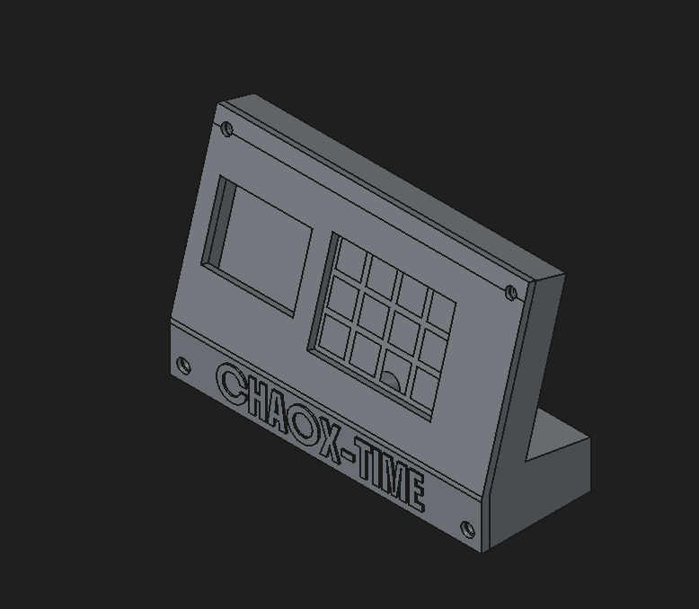
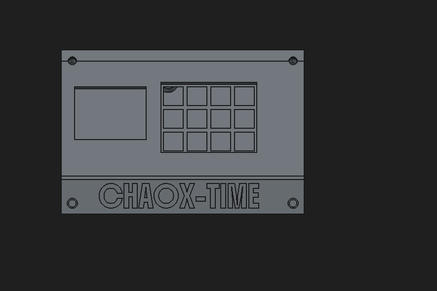

# CHAOX-TIME

this is a digital alarm clock 

This is my second hardware project 
I wanted to build it all by myself alone but i dont know how to code so i used AI to make the code 
for now i have used but i will learn code asap and then make it by myself 

## BOM

| Part | Qty | Approx. USD | Link |
|---|---:|---:|---|
| Seeed XIAO ESP32-C3 | 1 | $5.80–6.20 | [Alibaba](https://www.alibaba.com/pla/Original-New-Seeed-Studio-XIAO-ESP32C3_1600676681111.html) |
| 2.8" ILI9341 SPI TFT 240×320 | 1 | $5–10 | [Robu](https://robu.in/product/2-8-inch-spi-screen-module-tft-interface-240-x-320-without-touch/) |
| MCP23017-E/SP DIP-28 | 1 | $1–3 | [Mouser](https://www.mouser.com/c/?q=MCP23017-E%2FSP) |
| MAX98357A I2S amplifier module | 1 | $2–4 | [AliExpress](https://www.aliexpress.com/item/1005006982401474.html) |
| 8Ω 3W speaker | 1 | $1–3 | [AliExpress](https://www.aliexpress.com/wholesale?SearchText=8+ohm+3W+speaker) |
| 3.3V piezo buzzer | 1 | $0.50–1 | [AliExpress](https://www.aliexpress.com/wholesale?SearchText=3.3V+piezo+buzzer) |
| MX/Cherry-MX switches | 12 | $3–6 | [AliExpress](https://www.aliexpress.com/wholesale?SearchText=MX+mechanical+switches) |
| 1N4148 DO-35 diodes | 12 | $0.50–1 | [AliExpress](https://www.aliexpress.com/wholesale?SearchText=1N4148+DO-35) |
| 4.7kΩ 1/4W resistors | 2 | $0.10–0.50 | [AliExpress](https://www.aliexpress.com/wholesale?SearchText=4.7K+1%2F4W+resistor) |
| 100nF THT capacitors | 3 | $0.10–0.50 | [AliExpress](https://www.aliexpress.com/wholesale?SearchText=100nF+through+hole+capacitor) |
| 10µF electrolytic capacitor | 1 | $0.10–0.50 | [AliExpress](https://www.aliexpress.com/wholesale?SearchText=10uF+25V+radial+electrolytic+capacitor) |
| 2.54mm 1×8 header | 1 | $0.10–0.50 | [AliExpress](https://www.aliexpress.com/wholesale?SearchText=1x8+2.54mm+pin+header) |
| 2.54mm 1×7 header | 1 | $0.10–0.50 | [AliExpress](https://www.aliexpress.com/wholesale?SearchText=1x7+2.54mm+pin+header) |
| 2.54mm 1×2 header | 1 | $0.10–0.50 | [AliExpress](https://www.aliexpress.com/wholesale?SearchText=1x2+2.54mm+pin+header) |
| M3 heat-set inserts | 8 | $1–3 | [AliExpress](https://www.aliexpress.com/wholesale?SearchText=M3+brass+heat+set+inserts) |
| M3×8 screws | 4 | $0.50–1 | [AliExpress](https://www.aliexpress.com/wholesale?SearchText=M3x8+socket+head+screws) |
| M3×16 screws | 4 | $0.50–1 | [AliExpress](https://www.aliexpress.com/wholesale?SearchText=M3x16+socket+head+screws) |

**Estimated parts cost: ~$22–40 USD**
