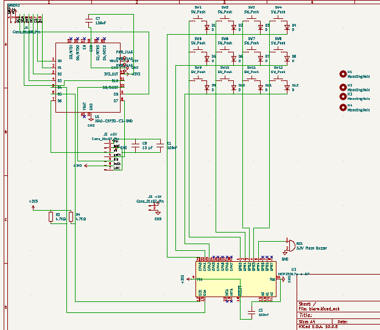
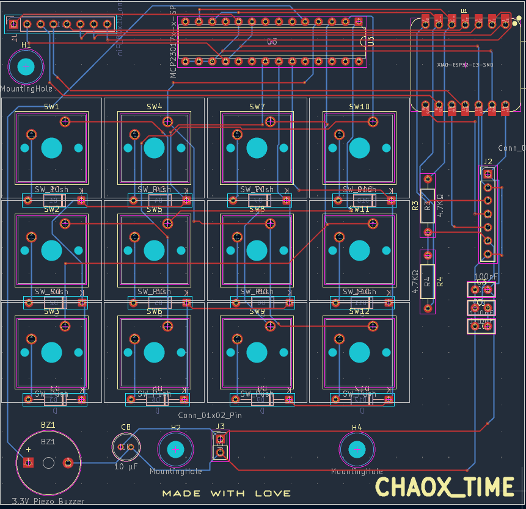

# CHAOX-TIME

this is a digital alarm clock 

This is my second hardware project 
I wanted to build it all by myself alone but i dont know how to code so i used AI to make the code 
for now i have used but i will learn code asap and then make it by myself 

## BOM

| Part | Qty | Approx. USD | Link |
|---|---:|---:|---|
| Seeed XIAO ESP32-C3 | 1 | $5.80–6.20 | [Alibaba](https://www.alibaba.com/pla/Original-New-Seeed-Studio-XIAO-ESP32C3_1600676681111.html) |
| 2.8" ILI9341 SPI TFT 240×320 | 1 | $5–10 | [Robu](https://robu.in/product/2-8-inch-spi-screen-module-tft-interface-240-x-320-without-touch/) |
| MCP23017-E/SP DIP-28 | 1 | $1–3 | [Mouser](https://www.mouser.com/c/?q=MCP23017-E%2FSP) |
| MAX98357A I2S amplifier module | 1 | $2–4 | [AliExpress](https://www.aliexpress.com/item/1005006982401474.html) |
| 8Ω 3W speaker | 1 | $1–3 | [AliExpress](https://www.aliexpress.com/wholesale?SearchText=8+ohm+3W+speaker) |
| 3.3V piezo buzzer | 1 | $0.50–1 | [AliExpress](https://www.aliexpress.com/wholesale?SearchText=3.3V+piezo+buzzer) |
| MX/Cherry-MX switches | 12 | $3–6 | [AliExpress](https://www.aliexpress.com/wholesale?SearchText=MX+mechanical+switches) |
| 1N4148 DO-35 diodes | 12 | $0.50–1 | [AliExpress](https://www.aliexpress.com/wholesale?SearchText=1N4148+DO-35) |
| 4.7kΩ 1/4W resistors | 2 | $0.10–0.50 | [AliExpress](https://www.aliexpress.com/wholesale?SearchText=4.7K+1%2F4W+resistor) |
| 100nF THT capacitors | 3 | $0.10–0.50 | [AliExpress](https://www.aliexpress.com/wholesale?SearchText=100nF+through+hole+capacitor) |
| 10µF electrolytic capacitor | 1 | $0.10–0.50 | [AliExpress](https://www.aliexpress.com/wholesale?SearchText=10uF+25V+radial+electrolytic+capacitor) |
| 2.54mm 1×40 header | 2 | $1-2 |
| M3 heat-set inserts | 8 | $1–3 | [AliExpress](https://www.aliexpress.com/wholesale?SearchText=M3+brass+heat+set+inserts) |
| M3×8 screws | 4 | $0.50–1 | [AliExpress](https://www.aliexpress.com/wholesale?SearchText=M3x8+socket+head+screws) |
| M3×16 screws | 4 | $0.50–1 | [AliExpress](https://www.aliexpress.com/wholesale?SearchText=M3x16+socket+head+screws) |

**Estimated parts cost: ~$22–40 USD**

#Features 

the current verdion has some less features than what i assumed when i started this project cause i forgot i had to code it myself but i dont know how to code so rn it has some less features but i m learning c++ so that i can add all the features i thought of when i started this project 

so now the features it has rn:
- shows the current time 
- it can fetch the time and date from internet using wifi
- it can set only 1 alarm //for now
- it beeps when alarm goes off
- we can stop the alam by 1 button

i have added the hardware in the PCB for future updates 

#Hardware

The main controller is the seeed xiao esp32 c3 board which controlls the whole clock 
itt has 12 switches so that we can change any setting we want 

the pcb contains:

- Seeed XIAO ESP32-C3
- 2.8" ILI9341 SPI TFT
- MCP23017-E/SP GPIO expander
- 12 MX/Cherry-MX compatible switches
- 12 × 1N4148 diodes
- 3.3V piezo buzzer
- MAX98357A I2S audio connection
- I2C pull-up resistors
- Decoupling capacitors
- M3 mounting holes

# Controls

The keypad is arranged as a 3×4 matrix.

The current firmware uses:

- UP - increase the selected value
- DOWN - decrease the selected value
- OK - enter/confirm
- Other keys are available for future functions

To set the alarm:

1. press the OK key from the main clock screen
2. use UP/DOWN to set the alarm hour
3. press OK
4. use UP/DOWN to set the alarm minute
5. press OK again to save and enable the alarm

When the alarm starts, pressing any key stops it

- u all can change the settings and everything by making ur own firmware

# Power

CHAOX-TIME is powered from a 5V USB power adapter.

#Assemble

pcb assembly is quite easy solder eerything on its place and upload he code then screw the pcb to the case and screw the case together 
Done..

# Future Plans

I want to add more features to CHAOX-TIME over time.

Some of the things I want to add are:

- Adhan audio
- Speaker support
- Prayer times
- Multiple alarms
- Countdown timer
- Better menus
- More keypad functions
- Volume control
- More clock settings
- Saving settings
- Improved UI

These features are planned and are not part of the current firmware yet.

#THANK YOU 

#CHAOX-TIME
